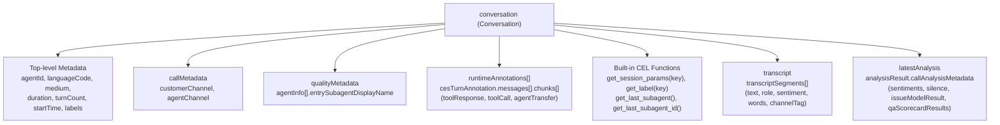

# Contact Center AI Insights CEL Cookbook & Reference Guide

This document is a comprehensive reference for authoring Common Expression Language (CEL) rules for Google Cloud Contact Center AI (CCAI) Insights Autolabeling Rules.

______________________________________________________________________

## 1. Overview & Evaluation Semantics

Autolabeling rules evaluate incoming conversations in real-time or during batch ingestion.

- **Evaluation Order**: Conditions are evaluated sequentially from top to bottom (first-match-wins).
- **Fallback Rules**: The last condition should always have an empty condition `condition: ""` to act as the default fallback tag.
- **String Literals**: Values in CEL expressions or return values should be properly quoted (e.g. `'Yes'`, `'No'`, `'vip_tier'`).
- **Return Value**: The matched `value` expression is assigned to the conversation's `labels[labelKey]`.
- **Field Naming Convention**: In CEL expressions, all protobuf fields are accessed using **camelCase** identifiers.
- **Defensive Property Access**: When traversing nested objects or maps that may be unset on some conversations, use `'fieldName' in object` guards (e.g., `'transcript' in conversation && 'transcriptSegments' in conversation.transcript`).

______________________________________________________________________

## 2. Conversation Resource Schema (`resources.proto`)

In CEL expressions, the root `conversation` variable provides direct access to the `google.cloud.contactcenterinsights.v1.Conversation` object. All field identifiers are in **camelCase**.



### 2.1 Top-Level Attributes

| Field Path                  | Type                  | Description                                                   | CEL Example                                                  |
| --------------------------- | --------------------- | ------------------------------------------------------------- | ------------------------------------------------------------ |
| `conversation.name`         | `string`              | Full resource name (`projects/*/locations/*/conversations/*`) | `conversation.name.endsWith('/conv123')`                     |
| `conversation.agentId`      | `string`              | Identifier of virtual agent / CXAS app / bot                  | `conversation.agentId == 'billing_bot'`                      |
| `conversation.languageCode` | `string`              | BCP-47 language tag                                           | `conversation.languageCode == 'es-US'`                       |
| `conversation.medium`       | `enum` / `int`        | `1` (PHONE_CALL), `2` (CHAT), `0` (UNSPECIFIED)               | `conversation.medium == 1`                                   |
| `conversation.duration`     | `duration` / `int`    | Total interaction duration (seconds)                          | `conversation.duration > 300`                                |
| `conversation.turnCount`    | `int`                 | Total number of conversational turns                          | `conversation.turnCount >= 10`                               |
| `conversation.startTime`    | `timestamp`           | Start timestamp of interaction                                | `conversation.startTime > timestamp('2026-01-01T00:00:00Z')` |
| `conversation.labels`       | `map[string, string]` | Custom key-value labels set on the conversation               | `conversation.labels['auth_status'] == 'verified'`          |

______________________________________________________________________

### 2.2 Call Metadata (`callMetadata`)

Defined by `message CallMetadata`:

| Field Path                                  | Type  | Description                                       | CEL Example                                      |
| ------------------------------------------- | ----- | ------------------------------------------------- | ------------------------------------------------ |
| `conversation.callMetadata.customerChannel` | `int` | Audio channel tag for customer (typically 1 or 2) | `conversation.callMetadata.customerChannel == 1` |
| `conversation.callMetadata.agentChannel`    | `int` | Audio channel tag for agent                       | `conversation.callMetadata.agentChannel == 2`    |

______________________________________________________________________

### 2.3 Runtime Session Parameters & Sub-Agent Metadata

In CCAI Insights, dynamic session parameters and sub-agent routing are exposed in CEL via **built-in CEL functions** that inspect `runtimeAnnotations` (Dialogflow intent parameters and CES/GECX `updated_variables`):

| Expression / Function                                       | Return Type | Description                                                                        | CEL Example                                                    |
| ----------------------------------------------------------- | ----------- | ---------------------------------------------------------------------------------- | -------------------------------------------------------------- |
| `get_session_params('param_key')`                           | `string`    | Retrieves a session parameter or CES updated variable from runtime annotations     | `get_session_params('auth_status') == 'verified'`              |
| `get_label('label_key')`                                    | `string`    | Retrieves a custom label value (equivalent to `conversation.labels[key]`)          | `get_label('tier') == 'vip'`                                   |
| `get_last_subagent()`                                       | `string`    | Returns the display name of the last sub-agent traversed in the conversation       | `get_last_subagent() == 'billing_specialist'`                  |
| `get_last_subagent_id()`                                    | `string`    | Returns the resource ID of the last sub-agent traversed in the conversation        | `get_last_subagent_id() == 'billing_v2'`                       |
| `conversation.qualityMetadata.agentInfo[0].entrySubagentDisplayName` | `string` | Display name of the entry sub-agent                                                | `conversation.qualityMetadata.agentInfo[0].entrySubagentDisplayName == 'onboarding'` |
| `conversation.qualityMetadata.agentInfo[0].entrySubagentId` | `string`    | ID of the entry sub-agent                                                          | `conversation.qualityMetadata.agentInfo[0].entrySubagentId == 'entry_flow'` |

______________________________________________________________________

### 2.4 Transcripts & Turn Segments (`transcript.transcriptSegments`)

Defined by `message Transcript` and `message TranscriptSegment`:

| Field Path                                                     | Type                      | Description                                                               | CEL Example                                                                                  |
| -------------------------------------------------------------- | ------------------------- | ------------------------------------------------------------------------- | -------------------------------------------------------------------------------------------- |
| `conversation.transcript.transcriptSegments`                   | `list[TranscriptSegment]` | Ordered sequence of conversation turns                                    | `conversation.transcript.transcriptSegments.size() > 15`                                     |
| `segment.text`                                                 | `string`                  | Transcribed text spoken/typed in turn                                     | `segment.text.contains('cancel my account')`                                                 |
| `segment.confidence`                                           | `float`                   | ASR speech-to-text confidence score (0.0 to 1.0)                          | `segment.confidence < 0.7`                                                                   |
| `segment.channelTag`                                           | `int`                     | Channel index (1 or 2)                                                    | `segment.channelTag == 1`                                                                    |
| `segment.segmentParticipant.role` / `segment.participant.role` | `enum` / `string` / `int` | `HUMAN_AGENT` (1), `AUTOMATED_AGENT` (2), `END_USER` (3), `ANY_AGENT` (4) | `segment.segmentParticipant.role == 'HUMAN_AGENT' \|\| segment.segmentParticipant.role == 1` |
| `segment.participant.userId`                                   | `string`                  | Unique identifier for the participant                                     | `segment.participant.userId != ''`                                                           |
| `segment.sentiment.score`                                      | `float`                   | Sentiment score (-1.0 to +1.0)                                            | `segment.sentiment.score < -0.5`                                                             |
| `segment.sentiment.magnitude`                                  | `float`                   | Sentiment strength / magnitude (0.0 to +inf)                              | `segment.sentiment.magnitude > 2.0`                                                          |

______________________________________________________________________

### 2.5 Runtime Annotations & CES Execution Traces (`runtimeAnnotations`)

CCAI Insights captures deep diagnostic traces of agent execution within `conversation.runtimeAnnotations`. Each entry contains `cesTurnAnnotation` detailing the exact message payloads, agent chunk emissions, tool executions, and state transfers:

- **`runtimeAnnotations`**: List of turn annotations.
- **`cesTurnAnnotation.messages`**: List of messages exchanged during the turn.
- **`message.chunks`**: List of action chunks emitted by the agent or runtime:
  - **`toolResponse`**: Results returned from a tool/webhook execution (`displayName`, `response.result`, `name`, `status`).
  - **`toolCall`**: Invocation request sent to a tool (`displayName`, `parameters`).
  - **`agentTransfer`**: Routing action transferring between agents (`targetAgent`).

#### CEL Transformation Pipeline for Tool Inspection:

```cel
'runtimeAnnotations' in conversation &&
conversation.runtimeAnnotations
  .filter(a, 'cesTurnAnnotation' in a && 'messages' in a.cesTurnAnnotation)
  .map(a, a.cesTurnAnnotation.messages)
  .flatten()
  .filter(m, 'chunks' in m)
  .map(m, m.chunks)
  .flatten()
  .exists(c, 'toolResponse' in c && c.toolResponse.displayName == 'my_tool')
```

______________________________________________________________________

### 2.6 Analysis Results & QA Scorecards (`latestAnalysis.analysisResult`)

Defined by `message Analysis`, `message AnalysisResult`, and `message CallAnalysisMetadata`:

| Field Path                                                                                  | Type                               | Description                                               | CEL Example                                                                                                                               |
| ------------------------------------------------------------------------------------------- | ---------------------------------- | --------------------------------------------------------- | ----------------------------------------------------------------------------------------------------------------------------------------- |
| `conversation.latestAnalysis.analysisResult.callAnalysisMetadata.sentiments`                | `list[ConversationLevelSentiment]` | Channel-level aggregated sentiment scores                 | `conversation.latestAnalysis.analysisResult.callAnalysisMetadata.sentiments.exists(s, s.channelTag == 1 && s.sentimentData.score < -0.3)` |
| `conversation.latestAnalysis.analysisResult.callAnalysisMetadata.silence.silencePercentage` | `float`                            | Percentage of interaction spent in silence (0.0 to 100.0) | `conversation.latestAnalysis.analysisResult.callAnalysisMetadata.silence.silencePercentage > 25.0`                                        |
| `conversation.latestAnalysis.analysisResult.callAnalysisMetadata.silence.silenceDuration`   | `duration`                         | Total silence duration                                    | `conversation.latestAnalysis.analysisResult.callAnalysisMetadata.silence.silenceDuration > 60`                                            |
| `conversation.latestAnalysis.analysisResult.callAnalysisMetadata.issueModelResult.issues`   | `list[IssueAssignment]`            | Topics assigned by Topic Models                           | `conversation.latestAnalysis.analysisResult.callAnalysisMetadata.issueModelResult.issues.exists(i, i.displayName == 'Billing Dispute')`   |
| `conversation.latestAnalysis.analysisResult.callAnalysisMetadata.phraseMatchers`            | `map[string, PhraseMatchData]`     | Phrase matchers triggered                                 | `'competitor_mention' in conversation.latestAnalysis.analysisResult.callAnalysisMetadata.phraseMatchers`                                  |
| `conversation.latestAnalysis.analysisResult.callAnalysisMetadata.qaScorecardResults`        | `list[QaScorecardResult]`          | Evaluation scorecard scores and question answers          | `conversation.latestAnalysis.analysisResult.callAnalysisMetadata.qaScorecardResults.exists(q, q.normalizedScore < 70.0)`                  |

______________________________________________________________________

## 3. Built-in CCAI Helper Functions

CCAI Insights provides specialized helper functions that simplify inspecting transcripts, session parameters, and annotators:

### 3.1 Sub-Agent / Flow Traversal

Checks whether a specific GECX/CXAS sub-agent or Dialogflow flow participated in the conversation:

```cel
containsSubAgent(conversation, "billing_specialist")
```

```cel
containsSubAgent(conversation, "order_lookup_flow")
```

### 3.2 Session Parameters & Context

Inspects session parameters captured during the interaction (from webhook responses or tool executions):

```cel
hasSessionParam(conversation, "authenticated", "true")
```

```cel
hasSessionParam(conversation, "membership_tier", "platinum")
```

### 3.3 Sentiment Analysis

Checks participant sentiment level:

```cel
// Customer sentiment is negative
hasCallerSentiment(conversation, "NEGATIVE")
```

```cel
// Agent sentiment is positive
hasAgentSentiment(conversation, "POSITIVE")
```

### 3.4 Entity & Intent Matching

Checks if specific entity types or intents were detected:

```cel
hasEntity(conversation, "CREDIT_CARD_DISPUTE")
```

```cel
hasIntent(conversation, "cancel_subscription")
```

______________________________________________________________________

## 4. Production Rule Examples & Recipes

### Example 1: Agent Inappropriate Language Detection (Regex & Role Matching)

Labels conversation as `'Yes'` if the agent uttered inappropriate words (`idiot` or `dumb`), otherwise `'No'`.

#### JSON Configuration:

```json
{
  "displayName": "Agent Inappropriate Language Detection",
  "description": "Labels conversation as Yes if agent used words 'idiot' or 'dumb', otherwise No",
  "active": true,
  "labelKeyType": "LABEL_KEY_TYPE_CUSTOM",
  "labelKey": "AgentInappropriateLanguage",
  "conditions": [
    {
      "condition": "'transcript' in conversation && 'transcriptSegments' in conversation.transcript && conversation.transcript.transcriptSegments.exists(s, 'text' in s && 'segmentParticipant' in s && 'role' in s.segmentParticipant && (s.segmentParticipant.role == 'HUMAN_AGENT' || s.segmentParticipant.role == 'AUTOMATED_AGENT' || s.segmentParticipant.role == 'ANY_AGENT' || s.segmentParticipant.role == 1 || s.segmentParticipant.role == 2 || s.segmentParticipant.role == 4) && s.text.matches('(?i).*\\\\b(idiot|dumb)\\\\b.*'))",
      "value": "'Yes'"
    },
    {
      "condition": "",
      "value": "'No'"
    }
  ]
}
```

#### YAML Declarative Format:

```yaml
- rule_id: "agent_inappropriate_language"
  display_name: "Agent Inappropriate Language Detection"
  label_key: "AgentInappropriateLanguage"
  label_key_type: "LABEL_KEY_TYPE_CUSTOM"
  active: true
  conditions:
    - condition: "'transcript' in conversation && 'transcriptSegments' in conversation.transcript && conversation.transcript.transcriptSegments.exists(s, 'text' in s && 'segmentParticipant' in s && 'role' in s.segmentParticipant && (s.segmentParticipant.role == 'HUMAN_AGENT' || s.segmentParticipant.role == 'AUTOMATED_AGENT' || s.segmentParticipant.role == 'ANY_AGENT' || s.segmentParticipant.role == 1 || s.segmentParticipant.role == 2 || s.segmentParticipant.role == 4) && s.text.matches('(?i).*\\\\b(idiot|dumb)\\\\b.*'))"
      value: "'Yes'"
    - condition: ""
      value: "'No'"
```

______________________________________________________________________

### Example 2: Active Flow & Tool Response Inspection

Labels conversation as `'Yes'` if `set_active_flow` tool executed successfully with `RxRefill_Agent` and `refill` value.

#### JSON Configuration:

```json
{
  "displayName": "Rx Refill Active Flow Rule",
  "description": "Labels conversation as Yes if set_active_flow was executed with RxRefill_Agent and refill value",
  "active": true,
  "labelKeyType": "LABEL_KEY_TYPE_CUSTOM",
  "labelKey": "RxRefillActiveFlow",
  "conditions": [
    {
      "condition": "'runtimeAnnotations' in conversation && conversation.runtimeAnnotations.filter(a, 'cesTurnAnnotation' in a && 'messages' in a.cesTurnAnnotation).map(a, a.cesTurnAnnotation.messages).flatten().filter(m, 'chunks' in m).map(m, m.chunks).flatten().exists(c, 'toolResponse' in c && 'displayName' in c.toolResponse && c.toolResponse.displayName == 'set_active_flow' && 'response' in c.toolResponse && 'result' in c.toolResponse.response && 'stored' in c.toolResponse.response.result && (c.toolResponse.response.result.stored == true || c.toolResponse.response.result.stored == 'true') && 'value' in c.toolResponse.response.result && c.toolResponse.response.result.value == 'refill' && (('target_agent' in c.toolResponse.response.result && c.toolResponse.response.result.target_agent == 'RxRefill_Agent') || ('targetAgent' in c.toolResponse.response.result && c.toolResponse.response.result.targetAgent == 'RxRefill_Agent')))",
      "value": "'Yes'"
    },
    {
      "condition": "",
      "value": "'No'"
    }
  ]
}
```

#### YAML Declarative Format:

```yaml
- rule_id: "rx_refill_active_flow"
  display_name: "Rx Refill Active Flow Rule"
  label_key: "RxRefillActiveFlow"
  label_key_type: "LABEL_KEY_TYPE_CUSTOM"
  active: true
  conditions:
    - condition: "'runtimeAnnotations' in conversation && conversation.runtimeAnnotations.filter(a, 'cesTurnAnnotation' in a && 'messages' in a.cesTurnAnnotation).map(a, a.cesTurnAnnotation.messages).flatten().filter(m, 'chunks' in m).map(m, m.chunks).flatten().exists(c, 'toolResponse' in c && 'displayName' in c.toolResponse && c.toolResponse.displayName == 'set_active_flow' && 'response' in c.toolResponse && 'result' in c.toolResponse.response && 'stored' in c.toolResponse.response.result && (c.toolResponse.response.result.stored == true || c.toolResponse.response.result.stored == 'true') && 'value' in c.toolResponse.response.result && c.toolResponse.response.result.value == 'refill' && (('target_agent' in c.toolResponse.response.result && c.toolResponse.response.result.target_agent == 'RxRefill_Agent') || ('targetAgent' in c.toolResponse.response.result && c.toolResponse.response.result.targetAgent == 'RxRefill_Agent')))"
      value: "'Yes'"
    - condition: ""
      value: "'No'"
```

______________________________________________________________________

### Example 3: Customer Escalation & Representative Demand Regex

Labels conversation as `'Yes'` if the end-user explicitly demanded to speak with a human agent or supervisor.

```yaml
- rule_id: "human_escalation_requested"
  display_name: "Human Escalation Requested"
  label_key: "HumanEscalationRequested"
  label_key_type: "LABEL_KEY_TYPE_CUSTOM"
  active: true
  conditions:
    - condition: "'transcript' in conversation && 'transcriptSegments' in conversation.transcript && conversation.transcript.transcriptSegments.exists(s, 'text' in s && 'segmentParticipant' in s && 'role' in s.segmentParticipant && (s.segmentParticipant.role == 'END_USER' || s.segmentParticipant.role == 3) && s.text.matches('(?i).*\\\\b(speak to (a )?human|representative|supervisor|agent|manager|real person)\\\\b.*'))"
      value: "'Yes'"
    - condition: ""
      value: "'No'"
```

______________________________________________________________________

### Example 4: Tool Execution Failure / Error Detection

Identifies interactions where any tool execution returned an error status or exception code.

```yaml
- rule_id: "tool_execution_failed"
  display_name: "Tool Execution Failure Detection"
  label_key: "ToolFailureDetected"
  label_key_type: "LABEL_KEY_TYPE_CUSTOM"
  active: true
  conditions:
    - condition: "'runtimeAnnotations' in conversation && conversation.runtimeAnnotations.filter(a, 'cesTurnAnnotation' in a && 'messages' in a.cesTurnAnnotation).map(a, a.cesTurnAnnotation.messages).flatten().filter(m, 'chunks' in m).map(m, m.chunks).flatten().exists(c, 'toolResponse' in c && 'response' in c.toolResponse && (('error' in c.toolResponse.response && c.toolResponse.response.error != '') || ('status' in c.toolResponse.response && c.toolResponse.response.status == 'ERROR')))"
      value: "'Yes'"
    - condition: ""
      value: "'No'"
```

______________________________________________________________________

### Example 5: Sub-Agent Routing & Containment Classifier

Classifies conversation category based on the sub-agents traversed during the session.

```yaml
- rule_id: "agent_domain"
  display_name: "Agent Domain Classifier"
  label_key: "AgentDomain"
  label_key_type: "LABEL_KEY_TYPE_CUSTOM"
  active: true
  conditions:
    - condition: "containsSubAgent(conversation, 'billing_specialist') || containsSubAgent(conversation, 'invoice_lookup')"
      value: "'billing'"
    - condition: "containsSubAgent(conversation, 'tech_support') || containsSubAgent(conversation, 'troubleshooting')"
      value: "'tech_support'"
    - condition: "containsSubAgent(conversation, 'sales_inquiry')"
      value: "'sales'"
    - condition: ""
      value: "'general_inquiry'"
```

______________________________________________________________________

## 5. Authoring Best Practices

1. **camelCase Identifiers**: Always use camelCase for protobuf message fields (e.g. `conversation.agentId`, `conversation.turnCount`, `conversation.startTime`, `conversation.callMetadata.customerChannel`).
1. **Defensive Guards**: Guard nested lookups with `'key' in object` (e.g., `'transcript' in conversation && 'transcriptSegments' in conversation.transcript`).
1. **Regex Word Boundaries**: When using `.matches('(?i)...')`, escape backslashes appropriately (use `\\\\b` in string literals or YAML double-quoted strings).
1. **List Transformation Pipelines**: Chain `.filter().map().flatten().exists()` to cleanly inspect deeply nested arrays like `runtimeAnnotations.cesTurnAnnotation.messages.chunks`.
1. **Deterministic Fallback**: Always ensure the final condition in every rule is `condition: ""` to guarantee deterministic labeling.
1. **Test via Dry-Run**: Always preview diffs before deploying (`cxas insights diff-autolabel-rules` or `push-autolabel-rules --dry-run`).
