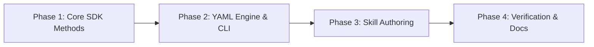

# Implementation Plan: `cxas-autolabel-rules` Skill & Tooling

* **Status:** Ready for Execution
* **Repository Path:** `.agents/skills/cxas-autolabel-rules/references/implementation_plan.md`
* **Design Doc:** `.agents/skills/cxas-autolabel-rules/references/design.md`

---

## 1. Execution Roadmap

---

## 2. Phase-by-Phase Breakdown

### Phase 1: Core SDK Extensions
**Files:** `src/cxas_scrapi/core/insights.py`, `tests/cxas_scrapi/core/test_insights.py`
* Add `list_autolabeling_rules(parent, page_size)`.
* Add `get_autolabeling_rule(name)`.
* Add `create_autolabeling_rule(auto_labeling_rule, auto_labeling_rule_id, parent)`.
* Add `update_autolabeling_rule(name, auto_labeling_rule, update_mask)`.
* Add `delete_autolabeling_rule(name)`.
* Unit tests for all REST operations with mocked API responses.

### Phase 2: Declarative YAML Engine & CLI
**Files:** `src/cxas_scrapi/core/autolabel_sync.py`, `src/cxas_scrapi/cli/insights_cli.py`
* Implement YAML parser and serializer for `autolabel_rules.yaml`.
* Implement `diff_rules(local, remote)` to detect added, updated, and deleted rules.
* Implement `sync_rules(client, local, force, dry_run)`.
* Wire CLI commands:
  * `cxas insights autolabel pull --out <file>`
  * `cxas insights autolabel diff --file <file>`
  * `cxas insights autolabel push --file <file> [--dry-run] [--force]`
* Unit tests for CLI subcommands and diff logic.

### Phase 3: AI Skill Scaffolding
**Directory:** `.agents/skills/cxas-autolabel-rules/`
* Create `SKILL.md` (Natural Language $\to$ CEL rules, YAML editing, GitOps deploy flow).
* Create `references/cel_cookbook.md` (curated recipes for sub-agent routing, session params, caller history, sentiment).
* Create `references/schema.json` (JSON schema for YAML linting).
* Create `scripts/sync_rules.py` helper script.

### Phase 4: Verification & Documentation
**Files:** `AGENTS.md`
* Register `cxas-autolabel-rules` in `AGENTS.md`.
* Run `uv run mdformat .agents/skills/cxas-autolabel-rules/SKILL.md`.
* Run `uv run ruff check --fix` and `uv run ruff format`.
* Run `uv run pytest` across all test suites.
* Run `uv run python3 scripts/check_brands.py --code-files`.

---

## 3. Review & Proceed

Click **Proceed** below or let me know when you'd like to start with **Phase 1 (Core SDK Extensions)**.
