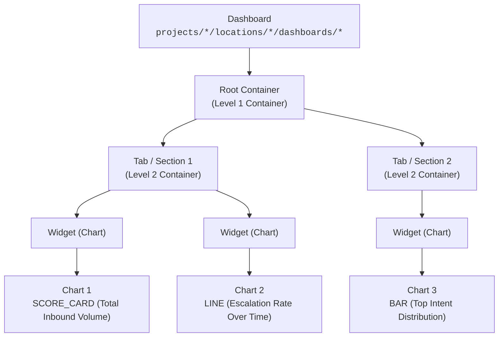

# Design Document: `cxas-configurable-dashboards` Skill & Insights Configurable Dashboard Architecture

* **Author:** Gokulnath Babu & Jetski
* **Status:** Draft / Proposed
* **Repository Path:** `.agents/skills/cxas-configurable-dashboards/references/design.md`
* **Target Components:** 
  * Skill: `.agents/skills/cxas-configurable-dashboards/`
  * Core SDK: `src/cxas_scrapi/core/insights.py` and `src/cxas_scrapi/core/dashboard_sync.py`
  * CLI: `src/cxas_scrapi/cli/insights_cli.py`
* **Reference Documentation:** [Customer Experience Insights Configurable Dashboards](https://docs.cloud.google.com/contact-center/insights/docs/configurable-dashboards)

---

## 1. Executive Summary

This document specifies a new agent skill (`cxas-configurable-dashboards`) and corresponding Core SDK / CLI enhancements in `cxas-scrapi` dedicated to **Contact Center AI (CCAI) Insights Configurable Dashboards**.

CCAI Insights introduces **Configurable Dashboards** (Next-Gen Visualizations), allowing users to build flexible multi-tab analytics dashboards with rich visual widgets (Score Cards, Bar/Line charts, Pie charts, Tables, Sankey diagrams) powered by Vega-Lite specifications and SQL queries against conversation metrics.

This design provides a streamlined declarative (GitOps / Dashboard-as-Code) workflow allowing developers and AI agents to:
1. **Define & Author** multi-tab dashboard layouts, tile containers, Vega-Lite visual specs, and SQL metrics queries in a declarative YAML schema (`dashboards.yaml`).
2. **Validate & Diff** dashboard structures locally with structural pre-flight checks against CCAI Insights backend constraints.
3. **Synchronize & Deploy** dashboards to GCP projects (`pull`, `push`, `diff`) with safe preview (`--dry-run`) and deletion protection (`--force`).

---

## 2. Background & Problem Statement

### 2.1 What are Configurable Dashboards?
CCAI Insights `Dashboard` resources (`google.cloud.contactcenterinsights.v1main.Dashboard`) represent customizable analytics reporting views. Each dashboard contains:
* **Metadata**: `displayName`, `description`, optional dashboard-level `filter`, and default `dateRangeConfig` (relative date ranges like last 7 days, or absolute query intervals).
* **Root Container**: The top-level widget container (`root_container`).
* **Nested Containers (Tabs & Sections)**: Top-level widgets within the root container represent tabs or layout sections with dimensions (`width`, `height` in grid units).
* **Widgets & Charts**: Tiles containing visualization configurations (`chartVisualizationType` e.g., `SCORE_CARD`, `BAR`, `LINE`, `PIE`, `TABLE`, `SANKEY`) and a `dataSource` (`GenerativeInsights`) containing the BigQuery `sqlQuery` and Vega-Lite `chartSpec`.

### 2.2 Challenges
* **Complex Nested JSON / Proto Structure**: Hand-crafting multi-level container/widget/chart structures via raw REST API calls is tedious and error-prone.
* **Vega-Lite & SQL Alignment**: Ensuring the Vega-Lite marks/encodings match the SQL output columns requires standardized patterns and validation.
* **Lack of Local Infrastructure-as-Code (IaC)**: Without a declarative format and diffing tool, managing dashboards across environments (dev -> staging -> prod) results in configuration drift.

---

## 3. Architecture & Component Breakdown

```
┌─────────────────────────────────────────────────────────────┐
│ 1. AI Agent Skill (.agents/skills/cxas-configurable-dashb.) │
│    - SKILL.md: Natural Language <-> Dashboard Engineering   │
│    - references/vega_cookbook.md: Chart & SQL recipes       │
│    - references/schema.json: JSON Schema                    │
│    - scripts/sync_dashboards.py: Standalone runner          │
└──────────────────────────────┬──────────────────────────────┘
                               │ uses
┌──────────────────────────────▼──────────────────────────────┐
│ 2. CLI Tooling (src/cxas_scrapi/cli/insights_cli.py)        │
│    - cxas insights pull-dashboards                          │
│    - cxas insights diff-dashboards                          │
│    - cxas insights push-dashboards (--dry-run, --force)     │
│    - cxas insights list-dashboards / get / delete           │
└──────────────────────────────┬──────────────────────────────┘
                               │ calls
┌──────────────────────────────▼──────────────────────────────┐
│ 3. Declarative Sync Engine (cxas_scrapi/core/dashboard_sync)│
│    - YAML <-> API proto normalization & validation          │
│    - Smart diff engine (colored terminal output)            │
│    - Upsert & deletion protection logic                     │
└──────────────────────────────┬──────────────────────────────┘
                               │ calls
┌──────────────────────────────▼──────────────────────────────┐
│ 4. Core SDK (src/cxas_scrapi/core/insights.py)              │
│    - REST CRUD methods for Dashboard & Chart APIs           │
└─────────────────────────────────────────────────────────────┘
```

---

## 4. Resource Data Model & Hierarchy

The CCAI Insights dashboard model (`google.cloud.contactcenterinsights.v1main.Dashboard`) uses a hierarchical container-and-widget tree structure:



### Hierarchy & Structural Rules

1. **Root Container**:
   - Every `Dashboard` must contain a `root_container` (`Container` message).
   - **Structural Constraint** (`ValidateDashboardStructure`): The direct children (`widgets`) of `root_container` must all be `Container` widgets representing tabs/sections.
2. **Container (Tabs & Groupings)**:
   - A `Container` holds display metadata (`display_name`, `description`), optional container-level filters and date ranges, layout dimensions (`width`, `height` in grid units), and a list of nested `Widget`s.
3. **Widget**:
   - Polymorphic wrapper supporting:
     - `container`: Nested container for sub-grouping.
     - `chart`: Embedded `Chart` definition (standard declarative approach).
     - `chart_reference`: Cloud resource name string referencing a standalone `Chart` sub-resource.
4. **Chart**:
   - `display_name`, `description`, `chart_visualization_type` (`BAR`, `LINE`, `AREA`, `PIE`, `SCATTER`, `TABLE`, `SCORE_CARD`, `SUNBURST`, `GAUGE`, `SANKEY`).
   - `width`, `height`: Grid dimensions (e.g. width 4, 6, 8, 12).
   - `filter`: Chart-specific conversation filter string.
   - `date_range_config`: Relative (`DAY`, `WEEK`, `MONTH`, `QUARTER`, `YEAR`) or absolute intervals.
   - `data_source`:
     - `generative_insights`:
       - `sql_query`: BigQuery SQL query executed against the mirrored/tenant dataset.
       - `chart_spec`: `google.protobuf.Struct` containing the Vega-Lite JSON specification.
       - `sql_comparison_key`: Optional string for comparing periods or datasets.
       - `chart_checkpoint`: `{session_id: ..., revision_id: ...}` for conversation trace tracking.

---

## 5. Declarative YAML Specification

The declarative YAML schema supports both multi-dashboard bundle files (`dashboards.yaml`) and single-dashboard files (`<dashboard_id>.yaml`), accepting both `snake_case` and `camelCase` keys.

### Example `dashboards.yaml`

```yaml
version: "v1"
dashboards:
  - dashboard_id: "agent_performance_kpi"
    display_name: "Agent Performance & Quality KPIs"
    description: "Key operational and quality metrics across human and automated agents."
    filter: "agent_id != ''"
    date_range:
      relative:
        quantity: 7
        unit: "DAY"

    root_container:
      display_name: "Root"
      widgets:
        - container:
            display_name: "Overview Tab"
            description: "High-level summary of inbound call volumes and containment."
            widgets:
              # Tile 1: Total Volume Scorecard
              - chart:
                  display_name: "Total Conversations"
                  description: "Total inbound conversations in the selected period"
                  chart_visualization_type: "SCORE_CARD"
                  width: 4
                  height: 3
                  data_source:
                    generative_insights:
                      sql_query: >-
                        SELECT COUNT(DISTINCT conversation_id) AS total_conversations
                        FROM conversations
                        WHERE TRUE
                      chart_spec:
                        mark: "text"
                        encoding:
                          text: {field: "total_conversations", type: "quantitative"}

              # Tile 2: Containment Rate Scorecard
              - chart:
                  display_name: "Containment Rate"
                  description: "Percentage of calls contained by virtual agents"
                  chart_visualization_type: "SCORE_CARD"
                  width: 4
                  height: 3
                  data_source:
                    generative_insights:
                      sql_query: >-
                        SELECT
                          ROUND(SAFE_DIVIDE(
                            COUNTIF(turn_count > 1 AND NOT REGEXP_CONTAINS(labels, 'Escalated')),
                            COUNT(1)
                          ) * 100, 1) AS containment_percentage
                        FROM conversations
                        WHERE TRUE
                      chart_spec:
                        mark: "text"
                        encoding:
                          text: {field: "containment_percentage", type: "quantitative"}

              # Tile 3: Top Issue Categories (Bar Chart)
              - chart:
                  display_name: "Top Contact Drivers"
                  description: "Distribution of customer intents and contact reasons"
                  chart_visualization_type: "BAR"
                  width: 12
                  height: 6
                  data_source:
                    generative_insights:
                      sql_query: >-
                        SELECT
                          issue_category,
                          COUNT(1) AS conversation_count
                        FROM conversations
                        WHERE issue_category IS NOT NULL
                        GROUP BY 1
                        ORDER BY conversation_count DESC
                        LIMIT 10
                      chart_spec:
                        mark: "bar"
                        encoding:
                          x: {field: "conversation_count", type: "quantitative", title: "Conversations"}
                          y: {field: "issue_category", type: "nominal", sort: "-x", title: "Category"}

        - container:
            display_name: "Quality & Compliance Tab"
            description: "Scorecard evaluation results and compliance tracking."
            widgets:
              - chart:
                  display_name: "Agent QA Score Over Time"
                  chart_visualization_type: "LINE"
                  width: 12
                  height: 6
                  data_source:
                    generative_insights:
                      sql_query: >-
                        SELECT
                          DATE(start_timestamp) AS date,
                          AVG(qa_score) AS average_score
                        FROM conversations
                        WHERE qa_score IS NOT NULL
                        GROUP BY 1
                        ORDER BY date ASC
                      chart_spec:
                        mark: "line"
                        encoding:
                          x: {field: "date", type: "temporal", title: "Date"}
                          y: {field: "average_score", type: "quantitative", title: "Avg QA Score"}
```

---

## 6. Implementation Plan & Phases

### Phase 1: Core SDK Enhancements (`src/cxas_scrapi/core/insights.py`)
Add direct CRUD operations for Dashboards and Charts:
* `list_dashboards(parent, filter_str, page_size, max_pages) -> list[dict[str, Any]]`
* `get_dashboard(name) -> dict[str, Any]`
* `create_dashboard(dashboard, dashboard_id, parent) -> dict[str, Any]`
* `update_dashboard(name, dashboard, update_mask="*") -> dict[str, Any]`
* `delete_dashboard(name) -> None`
* `list_charts(parent) -> list[dict[str, Any]]`
* `get_chart(name) -> dict[str, Any]`
* `create_chart(chart, chart_id, parent) -> dict[str, Any]`
* `update_chart(name, chart, update_mask="*") -> dict[str, Any]`
* `delete_chart(name) -> None`

### Phase 2: Declarative Sync Engine (`src/cxas_scrapi/core/dashboard_sync.py`)
Implement the declarative engine:
1. **Validation (`validate_dashboards_dict`)**:
   - Enforce root container existence and structure.
   - Enforce that top-level widgets in `root_container` are of type `Container`.
   - Validate visualization types against supported enum strings (`BAR`, `LINE`, `SCORE_CARD`, etc.).
   - Verify presence of `data_source` and valid Vega-Lite chart specs.
2. **Payload Normalization (`yaml_dashboard_to_api_payload`)**:
   - Normalize `snake_case` fields to API camelCase.
3. **Smart Diffing (`diff_dashboards`)**:
   - Compute `to_create`, `to_update`, `to_delete`, `unchanged` sets with side-by-side terminal diffs.
4. **Push Operations (`push_dashboards`)**:
   - Support `--dry-run`, atomic upserts, and `--force` deletion protection.
5. **Pull Operations (`pull_dashboards`)**:
   - Export remote GCP dashboards to a clean, canonical YAML file.

### Phase 3: CLI Subcommands (`src/cxas_scrapi/cli/insights_cli.py`)
Register new CLI commands under `cxas insights`:
* `cxas insights pull-dashboards --parent projects/.../locations/... [--out dashboards.yaml]`
* `cxas insights diff-dashboards [--file dashboards.yaml] [--parent projects/.../locations/...]`
* `cxas insights push-dashboards [--file dashboards.yaml] [--parent projects/.../locations/...] [--dry-run] [--force]`
* `cxas insights list-dashboards --parent projects/.../locations/...`
* `cxas insights get-dashboard --dashboard-name projects/.../locations/.../dashboards/...`
* `cxas insights delete-dashboard --dashboard-name projects/.../locations/.../dashboards/...`

### Phase 4: AI Skill & References (`cxas-configurable-dashboards`)
Create the AI Skill repository package:
* `.agents/skills/cxas-configurable-dashboards/SKILL.md`: Comprehensive skill instructions.
* `.agents/skills/cxas-configurable-dashboards/references/schema.json`: Formal JSON Schema.
* `.agents/skills/cxas-configurable-dashboards/references/vega_cookbook.md`: Guide to Vega-Lite marks, encodings, responsive layouts, and SQL patterns.
* `.agents/skills/cxas-configurable-dashboards/scripts/sync_dashboards.py`: Standalone runner.
* Register skill in root `AGENTS.md`.

---

## 7. Verification & Quality Plan

1. **Unit Testing**:
   - `tests/cxas_scrapi/core/test_insights.py`: Test all Dashboard/Chart CRUD methods on `Insights`.
   - `tests/cxas_scrapi/core/test_dashboard_sync.py`: Test schema validation, structural constraints, diff generation, push dry-run, push apply, force deletions, and pull serialization (100% statement and branch coverage).
   - `tests/cxas_scrapi/cli/test_insights_cli.py`: Test all CLI command handlers and argument parsers.
2. **Markdown and Link Testing**:
   - Run `uv run python tests/test_markdown_links.py` to ensure all cross-references are valid.
