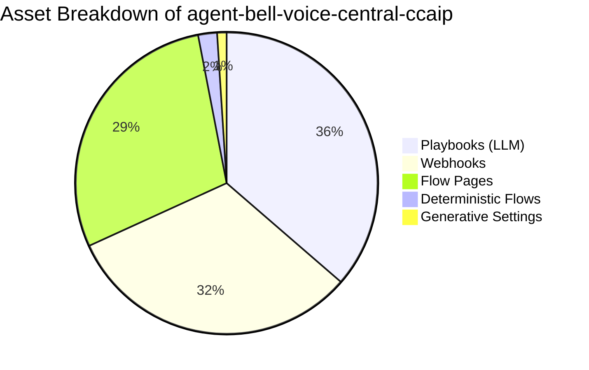

# Complete Asset Inventory & Audit Report
## Legacy Agent: `agent-bell-voice-central-ccaip`

> [!IMPORTANT]
> This audit provides a comprehensive asset breakdown of `agent-bell-voice-central-ccaip`, including OpenAPI specifications for custom webhooks, Vertex AI Search / Data Store findings, critical `$session.params` migration mapping to CXAS `{variables}`, and complete agent inventory.

---

## 1. OpenAPI Specifications for Custom Webhooks

Legacy DFCX relies on 63 webhook endpoints configured via generic REST webhooks. To migrate to CXAS, these webhooks must be converted into native **CXAS OpenAPI Tools**. Below are representative OpenAPI 3.0 YAML specifications generated from the legacy webhook configurations.

### 1.1. Ticket & Appointment Management Service (`ticket-management-tool.yaml`)

```yaml
openapi: 3.0.3
info:
  title: Bell Ticket Management & WFAS Service API
  version: 1.0.0
  description: Webhook API for ACUT trouble ticket search, OMF order summary, and WFAS appointment scheduling.
paths:
  /v1/ticket_management/acut/search:
    post:
      summary: Search ACUT Trouble Tickets
      operationId: searchAcutTickets
      requestBody:
        required: true
        content:
          application/json:
            schema:
              type: object
              properties:
                ban:
                  type: string
                  description: Billing Account Number
                telephone_number:
                  type: string
                  description: Wireline telephone number
                lob:
                  type: string
                  enum: [Home Phone, Internet, TV, Mobility]
      responses:
        '200':
          description: Successful search response
          content:
            application/json:
              schema:
                type: object
                properties:
                  ticket_count:
                    type: integer
                  tickets:
                    type: array
                    items:
                      type: object
                      properties:
                        ticket_number:
                          type: string
                        ticket_state:
                          type: string
                        creation_time:
                          type: string

  /v1/ticket_management/omf/calendar#availability:
    post:
      summary: Check WFAS Appointment Calendar Availability
      operationId: checkAppointmentAvailability
      requestBody:
        required: true
        content:
          application/json:
            schema:
              type: object
              properties:
                ticket_number:
                  type: string
                postal_code:
                  type: string
                preferred_date:
                  type: string
                  format: date
      responses:
        '200':
          description: Calendar availability response
          content:
            application/json:
              schema:
                type: object
                properties:
                  hasAvailableTimeslot:
                    type: boolean
                  dates:
                    type: array
                    items:
                      type: object
                      properties:
                        date:
                          type: string
                        timeslots:
                          type: array
                          items:
                            type: string

  /v1/ticket_management/wfas#appointment:
    post:
      summary: Reschedule Technician Appointment
      operationId: updateAppointment
      requestBody:
        required: true
        content:
          application/json:
            schema:
              type: object
              properties:
                ticket_number:
                  type: string
                selected_date:
                  type: string
                selected_timeslot:
                  type: string
      responses:
        '200':
          description: Appointment update confirmation
```

### 1.2. Customer Authentication & Identification Service (`customer-auth-tool.yaml`)

```yaml
openapi: 3.0.3
info:
  title: Bell Customer Identification & Authentication API
  version: 1.0.0
  description: Customer identification lookup and OTP/PIN verification endpoints.
paths:
  /v1/customer-identification#search-by-ban:
    post:
      summary: Search Customer by BAN
      operationId: searchByBan
      requestBody:
        required: true
        content:
          application/json:
            schema:
              type: object
              properties:
                ban:
                  type: string
      responses:
        '200':
          description: Customer profile returned

  /v1/customer-authentication#send-otp:
    post:
      summary: Dispatch One-Time Password via SMS
      operationId: sendOtp
      requestBody:
        required: true
        content:
          application/json:
            schema:
              type: object
              properties:
                telephone_number:
                  type: string
                language:
                  type: string
                  enum: [en, fr-ca]
      responses:
        '200':
          description: OTP dispatched successfully

  /v1/customer-authentication#validate-otp:
    post:
      summary: Validate Customer Entered OTP
      operationId: validateOtp
      requestBody:
        required: true
        content:
          application/json:
            schema:
              type: object
              properties:
                otp_code:
                  type: string
                session_id:
                  type: string
      responses:
        '200':
          description: Validation result
          content:
            application/json:
              schema:
                type: object
                properties:
                  isValid:
                    type: boolean
```

### 1.3. Complete Webhook Endpoints Directory (63 Total)

| Category | Endpoint / Webhook Display Name | Timeout | Target CXAS OpenAPI Tool |
|---|---|---|---|
| **Ticket Mgmt** | `/v1/ticket_management/acut/search` | 20s | `acut_ticket_tool` |
| **Ticket Mgmt** | `/v1/ticket_management/acut/search#retrieve` | 30s | `acut_ticket_tool` |
| **Ticket Mgmt** | `/v1/ticket_management/omf/calendar#availability` | 30s | `wfas_calendar_tool` |
| **Ticket Mgmt** | `/v1/ticket_management/omf/order#detail` | 30s | `omf_order_tool` |
| **Ticket Mgmt** | `/v1/ticket_management/omf/order#summary-Homephone` | 30s | `omf_order_tool` |
| **Ticket Mgmt** | `/v1/ticket_management/omf/order#summary-Internet` | 30s | `omf_order_tool` |
| **Ticket Mgmt** | `/v1/ticket_management/omf/order#summary-TV` | 30s | `omf_order_tool` |
| **Ticket Mgmt** | `/v1/ticket_management/wfas#appointment` | 30s | `wfas_appointment_tool` |
| **Ticket Mgmt** | `/v1/ticket_management/wfas#cancel` | 30s | `wfas_appointment_tool` |
| **Ticket Mgmt** | `/v1/ticket_management/wfas_check_availability` | 30s | `wfas_calendar_tool` |
| **Auth & Ident** | `v1/customer-identification#search-by-ban` | 30s | `customer_ident_tool` |
| **Auth & Ident** | `v1/customer-identification#search-by-tn` | 30s | `customer_ident_tool` |
| **Auth & Ident** | `v1/customer-identification#search-region-by-tn` | 30s | `customer_ident_tool` |
| **Auth & Ident** | `v1/customer-authentication#send-otp` | 30s | `customer_auth_tool` |
| **Auth & Ident** | `v1/customer-authentication#validate-otp` | 30s | `customer_auth_tool` |
| **Auth & Ident** | `v1/customer-authentication#validate-pin` | 30s | `customer_auth_tool` |
| **Auth & Ident** | `v1/customer-authentication#set-auth-status` | 30s | `customer_auth_tool` |
| **Auth & Ident** | `v1/customer-authentication#start-auth-session` | 30s | `customer_auth_tool` |
| **Billing & Pay** | `v1/account-information/get-account-balance-details` | 30s | `billing_account_tool` |
| **Billing & Pay** | `v1/account-information/get-clp-details` | 30s | `billing_account_tool` |
| **Billing & Pay** | `v1/one-time-payment#create-order` | 30s | `payment_processing_tool` |
| **Billing & Pay** | `v1/one-time-payment#submit-order` | 30s | `payment_processing_tool` |
| **Billing & Pay** | `v1/payment-arrangement#create-order` | 30s | `payment_arrangement_tool` |
| **Billing & Pay** | `v1/payment-arrangement#submit-order` | 30s | `payment_arrangement_tool` |
| **Outage & Tools**| `v1/digital-tools/outage-check#start-process` | 30s | `outage_check_tool` |
| **Outage & Tools**| `v1/digital-tools/outage-check#status-update` | 30s | `outage_check_tool` |
| **TV Signal** | `v1/sat-rehit` | 30s | `sat_tv_rehit_tool` |
| **Routing** | `v1/agent-queue-determination` | 30s | `aqd_routing_tool` |
| **Support** | `v1/dfcx_support/client_info#local-time` | 30s | `client_info_tool` |
| **Support** | `v2/self-help-messaging` | 30s | `self_help_messaging_tool` |

---

## 2. Vertex AI Search / Data Store Audit

### Audit Findings
- **Data Store Connections:** An exhaustive scan across all DFCX flow parameters, page routes, playbook settings (`en.json`, `fr-ca.json`), tool configs, and generator settings reveals **0 active Vertex AI Search Data Store IDs attached to the legacy export**.
- **Knowledge Architecture:** Rather than using passive DFCX Knowledge Connectors, the legacy agent relies on custom dynamic lookup webhooks (`/v1/dfcx_support/content_lookup#...`) combined with 72 specialized Gemini Playbooks that embed instruction guidelines in prompt text.
- **CXAS Target Recommendation:** During CXAS migration, standard FAQ lookups (e.g., CLP details, equipment warranties, self-help FAQs) should optionally be attached to CXAS Data Stores (`projects/<project>/locations/global/collections/default_collection/dataStores/<datastore-id>`) using CXAS Grounding Tools.

---

## 3. Critical `$session.params` & CXAS `{variables}` Migration Mapping

The legacy DFCX agent relies on **150+ session parameters**. Below is the catalog of critical session parameters categorized by domain, complete with their purpose and explicit CXAS `{variable}` definitions.

### 3.1. Customer Identification & Session Context

| Legacy DFCX Parameter | CXAS Variable Name | Data Type | Default | Description |
|---|---|---|---|---|
| `$session.params.BAN` | `{ban}` | STRING | `""` | Billing Account Number |
| `$session.params.Phone_Number` | `{phone_number}` | STRING | `""` | Customer contact phone number |
| `$session.params.wireline_telephone_number` | `{wireline_telephone_number}` | STRING | `""` | Wireline landline number |
| `$session.params.clid` | `{clid}` | STRING | `""` | Calling Line Identification (Caller ID) |
| `$session.params.postal_code` | `{postal_code}` | STRING | `""` | Customer Postal Code |
| `$session.params.auth_status` | `{auth_status}` | STRING | `"UNAUTHENTICATED"` | Authentication state (`AUTHENTICATED`, `FAILED`) |
| `$session.params.customer_type` | `{customer_type}` | STRING | `"RESIDENTIAL"` | Customer segment (`RESIDENTIAL`, `BUSINESS`) |
| `$session.params.language` | `{language}` | STRING | `"en"` | Interaction language (`en`, `fr-ca`) |

### 3.2. Trouble Ticket & WFAS Appointment Management

| Legacy DFCX Parameter | CXAS Variable Name | Data Type | Default | Description |
|---|---|---|---|---|
| `$session.params.ticket_number` | `{ticket_number}` | STRING | `""` | ACUT trouble ticket ID |
| `$session.params.ticket_state` | `{ticket_state}` | STRING | `""` | Current ticket state |
| `$session.params.ticket_lob` | `{ticket_lob}` | STRING | `""` | Line of business associated with ticket |
| `$session.params.ticket_date` | `{ticket_date}` | STRING | `""` | Original scheduled appointment date |
| `$session.params.time_slot` | `{time_slot}` | STRING | `""` | Confirmed time slot |
| `$session.params.wfas_availability_response` | `{wfas_availability_response}` | OBJECT | `{}` | WFAS calendar slots payload |
| `$session.params.original_appointment_date` | `{original_appointment_date}` | STRING | `""` | Pre-change appointment date |
| `$session.params.all_appointment_done` | `{all_appointment_done}` | BOOLEAN | `false` | Flag indicating all changes completed |

### 3.3. Satellite & Fibe TV Rehit

| Legacy DFCX Parameter | CXAS Variable Name | Data Type | Default | Description |
|---|---|---|---|---|
| `$session.params.tv_account_number` | `{tv_account_number}` | STRING | `""` | TV receiver account ID |
| `$session.params.tv_sub_type` | `{tv_sub_type}` | STRING | `""` | TV product type (`SatTV`, `FibeTV`) |
| `$session.params.rehit_status` | `{rehit_status}` | STRING | `""` | Signal rehit execution status |
| `$session.params.trouble_type_code` | `{trouble_type_code}` | STRING | `""` | Receiver error code |

### 3.4. Agent Queue Determination & Routing

| Legacy DFCX Parameter | CXAS Variable Name | Data Type | Default | Description |
|---|---|---|---|---|
| `$session.params.aqd_counter` | `{aqd_counter}` | INTEGER | `0` | Transfer attempt retry counter |
| `$session.params.handover_category` | `{handover_category}` | STRING | `""` | Target agent skill queue category |
| `$session.params.special_queue` | `{special_queue}` | STRING | `""` | Priority routing flag |
| `$session.params.va_to_ccaip` | `{va_to_ccaip}` | OBJECT | `{}` | CCAIP context transfer payload |

---

## 4. Comprehensive Asset Inventory Summary



| Asset Category | Total Count | Details & Key Artifacts |
|---|---|---|
| **Agent Core Config** | 1 | `agent.json` (Default timezone: `America/Toronto`, Languages: `en`, `fr-ca`) |
| **Deterministic Flows** | 4 | `default_flow`, `bell_ticket_mgmt_acut_change_reschedule_ticket`, `bell_tech_field_tech_visit_cancel_flow`, `bell_appt_mgmt_mya_pitch_1`, `bell_rehit_Sat_TV` |
| **Flow Pages** | 57 | 40 pages in reschedule flow, 9 pages in rehit flow, 5 in MYA flow, 3 in cancel flow |
| **Generative Playbooks** | 72 | LLM dialog agents (`bell_UC_Technical_Support`, `bell_UC_Billing`, `bell_UC_Sales`, etc.) |
| **Webhooks** | 63 | REST API definitions for backend microservices |
| **Generative Settings** | 2 | `en.json`, `fr-ca.json` (`gemini-2.5-flash`, temperature 0.9, indefinite context) |
| **Intents & Entities** | 100+ | Pre-configured NLU intents & custom entity types |
| **Route Groups** | Multiple | Transition route groups for error handling and global fallbacks |
