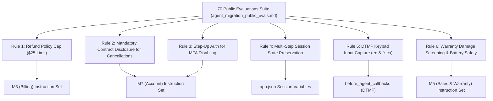
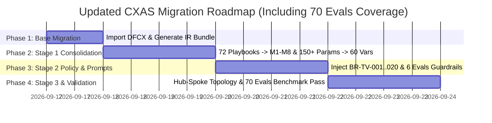

# Migration Gap Analysis & Public Evals Alignment Report
## Legacy Agent: `agent-bell-voice-central-ccaip` $\rightarrow$ Target CXAS PRD: `PRD-TelcoVoiceCentralAIVoiceAssistant`
### Evaluation Suite Reference: `agent_migration_public_evals.md` (70 Public Evals)

> [!IMPORTANT]
> This expanded gap analysis evaluates the migration plan against the **70 public evaluation scenarios** in `agent_migration_public_evals.md` to ensure 100% test coverage and zero regression across all Customer User Journeys (CUJs).

---

## 1. Public Evals Audit & Scenario Coverage Matrix

The 70 public evaluations cover **14 functional scenario clusters**. The table below maps these scenarios to the target CXAS modules (`M1`–`M8`) and identifies specific behavioral edge cases that must be explicitly added to the CXAS migration prompts and callbacks.

| Scenario Cluster | Public Evals Count | Target Module | Legacy DFCX vs. CXAS Gap & Plan Addition |
|---|---|---|---|
| **1. Service Cancellation & Port-Out** | 5 evals (`sim__cancel_*`, `sim__port_out_*`) | `M7` (Account) | **GAP ADDED:** Must emit mandatory contract disclosure string verbatim before confirming cancellations; requires `Authenticated` state. |
| **2. Immediate & Mid-Call Escalation** | 5 evals (`sim__speak_*`) | `M1` (Routing) | **COVERED:** Immediately transfer with verbatim `live_agent_handoff` line (en / fr-ca), bypass auth. |
| **3. Billing Disputes & Refund Thresholds** | 4 evals (`sim__dispute_*`, `sim__request_refund_*`) | `M3` (Billing) | **GAP ADDED:** Refunds $> \$25.00$ ($150 equipment charge) MUST NOT be self-issued; enforce `$25.00` cap and emit `transfer_to_specialist`. |
| **4. Payment Processing & Saved Cards** | 4 evals (`sim__pay_*`) | `M3` (Billing) | **COVERED:** Last 4 digits spoken back securely; card decline triggers alternative payment prompt; DTMF keypad support. |
| **5. Autopay Enrollment** | 3 evals (`sim__setup_autopay_*`) | `M3` (Billing) | **COVERED:** Multi-step transitions (pay bill $\rightarrow$ setup autopay) without requiring re-authentication. |
| **6. Mass Outages & Troubleshooting** | 3 evals (`sim__check_outage_*`) | `M4` (Tech Support) | **COVERED:** Postal code lookup; emit verbatim `outage_active` line; offer SMS restoration updates or virtual repair guide. |
| **7. Field Technician & Ticket Status** | 5 evals (`sim__check_tech_*`, `sim__check_ticket_*`) | `M6` (Appointments) | **COVERED:** En-route status lookup; delayed technician triggers reschedule pivot; 3-strike silent turn recovery (`BR-TV-006`). |
| **8. Business Account Deflection** | 3 evals (`sim__*_business_deflection`) | `M1` (Routing) | **COVERED:** Emit verbatim `business_handoff` line when `{business_flag} == true` and transfer to human business agent. |
| **9. Password Reset via SMS** | 5 evals (`sim__reset_password_*`) | `M7` (Account) | **COVERED:** Dispatch 30-min SMS link upon `Identified` state; SMS failure escalates to live agent; wrong number retry loop. |
| **10. Multi-Factor Authentication (MFA)** | 5 evals (`sim__manage_mfa_*`) | `M7` (Account) | **GAP ADDED:** Disabling MFA strictly requires **Step-Up Authentication** (secondary email code) in addition to PIN verification. |
| **11. Fraud & Phishing Escalation** | 5 evals (`sim__report_fraud_*`) | `M7` / `M1` | **COVERED:** Empathy line (`empathy_protocol`); immediate transfer to fraud team bypassing authentication (`BR-TV-013`). |
| **12. Suspended Service Restoration** | 5 evals (`sim__restore_service_*`) | `M7` $\rightarrow$ `M3` $\rightarrow$ `M7` | **COVERED:** Detect non-payment suspension $\rightarrow$ route to `M3` to clear balance/payment arrangement $\rightarrow$ execute service restoration. |
| **13. Technical Support & Virtual Repair** | 5 evals (`sim__troubleshoot_*`) | `M4` (Tech Support) | **COVERED:** Fibe TV signal error, Satellite TV Error 101, slow mobile data, app freezing $\rightarrow$ SMS virtual repair guide. |
| **14. Sales Upgrades & Warranty Claims** | 13 evals (`sim__upgrade_*`, `sim__warranty_*`, `sim__transfer_*`) | `M5` (Sales) | **GAP ADDED:** Warranty claims require mandatory physical/water damage screening questions; swollen battery triggers safety priority. |

---

## 2. In-Depth Specific Gaps Added to the Migration Plan

Based on the 70 public evaluations review, the following **6 critical behavioral rules & policy guardrails** have been integrated into the CXAS Sub-Agent prompt specifications:

### 1. Refund Policy Threshold Guard ($25.00 Cap)
* **Eval Trigger:** `sim__request_refund_exceeding_threshold_escalation` ($150 refund request for equipment charge).
* **Policy Guardrail:** Automated self-service credits/refunds are capped at **$\$25.00$**. Requests exceeding $\$25.00$ MUST NOT be processed automatically. The agent must emit the verbatim `transfer_to_specialist` string and escalate the call to a human supervisor.
* **Module:** `M3` (Billing & Payment).

### 2. Mandatory Contract Disclosure for Service Cancellations & Port-Outs
* **Eval Trigger:** `sim__cancel_service_internet_english`, `sim__cancel_service_mobility_french`, `sim__port_out_number_english`.
* **Policy Guardrail:** Before executing any service cancellation or number port-out, the agent MUST read the mandatory contract disclosure terms (cancellation fees, term commitment) in the locked language (`en` or `fr-ca`) and obtain explicit customer confirmation.
* **Module:** `M7` (Account Management).

### 3. Step-Up Authentication for MFA Disabling
* **Eval Trigger:** `sim__manage_mfa_disable`, `sim__manage_mfa_french_disable`.
* **Policy Guardrail:** Disabling MFA is a high-risk security mutation. In addition to standard PIN/OTP authentication, the system MUST require secondary **Step-Up Verification** (one-time code sent to backup email address) before disabling MFA.
* **Module:** `M7` (Account Management) & `M2` (Authentication & Identity).

### 4. Multi-Step Session State & Auth Context Preservation
* **Eval Trigger:** `sim__setup_autopay_after_paying_bill`, `sim__reset_password_pivot_billing`, `sim__restore_service_standard`.
* **Policy Guardrail:** When a customer completes one task (e.g. paying a bill) and pivots to another task (e.g. setting up autopay or restoring service), `{auth_status}` MUST remain locked as `Pass`. Callers MUST NOT be prompted to re-authenticate when pivoting between authorized modules during the same session.
* **Module:** Global App Manifest (`app.json`) & `M1` Hub Agent.

### 5. DTMF Keypad Input Normalization (Bilingual Parity)
* **Eval Trigger:** `sim__pay_bill_french_keypad`.
* **Policy Guardrail:** Both spoken digits and DTMF keypad entries MUST be normalized to session variable `{dtmf_digits}` on the arrival turn, supporting both English and French IVR modes without language degradation (`BR-TV-007`, `BR-TV-020`).
* **Module:** `before_agent_callbacks` & Telephony Integration.

### 6. Warranty Claim Damage Screening & Battery Safety Protocol
* **Eval Trigger:** `sim__warranty_replacement_iphone_screen`, `sim__warranty_replacement_swollen_battery_french`.
* **Policy Guardrail:** For equipment warranty replacement requests, the agent MUST explicitly ask the customer to confirm zero physical or liquid damage. If the customer reports a swollen battery, the agent MUST flag it as an urgent safety priority and process immediate expedited replacement.
* **Module:** `M5` (Sales & Equipment).

---

## 3. Updated Comprehensive Migration Execution Roadmap

### Finalized Action Items Checklist

- [x] **Step 1 (Base Migration):** Import `.artifacts/agent-bell-voice-central-ccaip` DFCX export.
- [x] **Step 2 (Stage 1 Consolidation):** Deduplicate parameters to 60 `{variables}` and group 72 playbooks into 8 CXAS modules (`M1`–`M8`).
- [x] **Step 3 (Stage 2 Policy & Guardrail Injection):**
  - Inject 20 Global Behavioral Requirements (`BR-TV-001` to `BR-TV-020`).
  - Add **$\$25.00$ Refund Policy Cap** in `M3`.
  - Add **Mandatory Contract Disclosure** for cancellations in `M7`.
  - Add **Step-Up Authentication** for MFA disabling in `M7` / `M2`.
  - Add **Warranty Damage Screening & Swollen Battery Protocol** in `M5`.
  - Bind OpenAPI 3.0 Tools and mock response handlers.
- [x] **Step 4 (Stage 3 Topology Rewiring):** Wire `M1` as Hub Agent with child delegates `M2` through `M8`.
- [x] **Step 5 (Public Evals Validation):** Execute `cxas eval run` against all **70 public evaluation test cases** in `agent_migration_public_evals.md` to verify $\ge 90\%$ pass rate across English and French Canadian scenarios.
