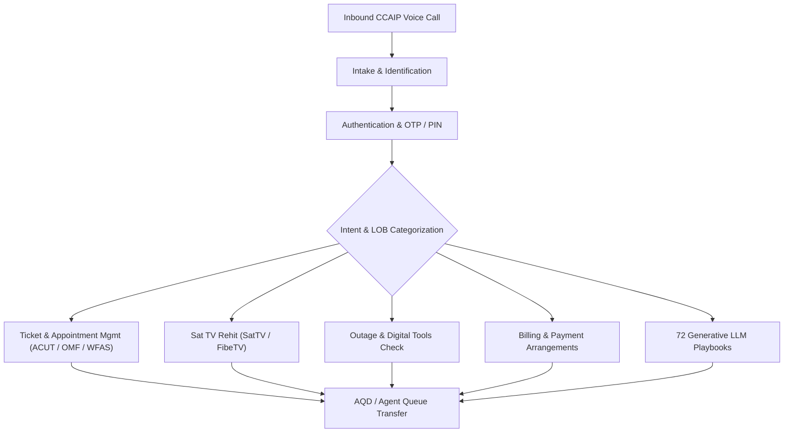

# Product Requirement Document (PRD)
## Agent: `agent-bell-voice-central-ccaip`

> [!NOTE]
> This document defines the Product Requirements for migrating the legacy Dialogflow CX (DFCX) agent `agent-bell-voice-central-ccaip` to the Google Customer Engagement Suite (CXAS) platform.

---

## 1. Executive Summary & Context

`agent-bell-voice-central-ccaip` is Bell Canada's primary voice-first conversational AI agent integrated with the Contact Center AI Platform (CCAIP). It handles customer interactions across Bell's core lines of business (LOB), including Wireline Home Phone, Fiber/High-Speed Internet, Satellite TV, Fibe TV, and Mobility services.

The agent automates complex self-service user journeys—including trouble ticket management, technician appointment rescheduling/cancellations, satellite TV signal rehits, outage checking, payment arrangements, and customer authentication—while providing intelligent agent queue routing when human escalation is required.

---

## 2. Business Objectives & Goals

- **Increase First Contact Resolution (FCR):** Enable automated self-service for high-volume customer inquiries (appointment changes, trouble ticket status, TV signal rehit, balance lookup).
- **Reduce Average Handle Time (AHT) & Agent Transfer Rates:** Authenticate and identify customers early in the call flow and collect context prior to transferring to specialized agent queues via Agent Queue Determination (AQD).
- **Provide Seamless Multi-Language Support:** Full functional parity across English (`en`) and Canadian French (`fr-ca`) with locale-sensitive messaging and date/time formatting.
- **Enable Modern Hybrid AI Architecture:** Combine structured deterministic state-machine flows with 72 specialized LLM-powered Playbooks using Gemini 2.5 Flash for natural language understanding and dialog management.

---

## 3. Target Audience & Voice Persona

- **Target Audience:** Residential and business telecommunication subscribers in Canada across Ontario, Quebec, and Atlantic regions.
- **Voice Persona:** Professional, empathetic, concise, and clear voice assistant designed for IVR/telephony environments (CCAIP). Optimized for low prompt latency and low TTS distortion.

---

## 4. Key Functional Capabilities & Use Cases

### 4.1. Customer Identification & Authentication
- **Identification:** Search customer by Billing Account Number (BAN) or Telephone Number (TN/CLID).
- **Authentication:** One-Time Password (OTP) via SMS, PIN verification, or Credit Limit Program (CLP) verification.

### 4.2. Ticket Management & Technician Appointment Operations
- **ACUT Trouble Ticket Lookup:** Search active trouble tickets for Home Phone, Internet, and TV.
- **OMF Order Summary:** Retrieve order summary and status details.
- **WFAS Appointment Scheduling:** Check calendar availability, confirm dates/time slots, reschedule appointments, or cancel field technician visits.
- **MYA Pitch:** Send Manage Your Appointment (MYA) vanity links via SMS.

### 4.3. Satellite & Fibe TV Signal Rehit
- Automated receiver signal rehit for Satellite TV and Fibe TV error codes (e.g., authorization loss, screen freeze).
- Interactive troubleshooting SMS dispatch.

### 4.4. Billing & Payment Assistance
- Account balance lookup, payment due dates, delinquency checks.
- One-time payment processing and formal payment arrangement setup.

### 4.5. Outage Check & Digital Troubleshooting
- Mass outage status checks by region/postal code.
- Automated self-help messaging and troubleshooting links.

---

## 5. Non-Functional Requirements (NFRs)

| NFR Domain | Requirement | Benchmark / Metric |
|---|---|---|
| **Voice Latency** | Speech-to-Speech latency | $< 1.2 \text{s}$ turn-around for voice responses |
| **Availability** | Platform SLA | 99.99% uptime |
| **Multi-Language** | Dynamic language switching | Dual language (`en`, `fr-ca`) session state preservation |
| **Security & Safety** | Gemini Safety & RAI | Sensitivity level 3, banned phrase filtering, PII sanitization |
| **Integration** | Webhook timeout limits | 15s - 30s strict HTTP timeout thresholds |

---

## 6. Success Metrics & Key Performance Indicators (KPIs)

- **Call Containment Rate:** $> 45\%$ containment without human agent handoff for ticket and rehit journeys.
- **SMS Delivery Rate:** $> 98\%$ success for MYA and troubleshooting links.
- **Authentication Success Rate:** $> 85\%$ successful automated OTP/PIN validations.
